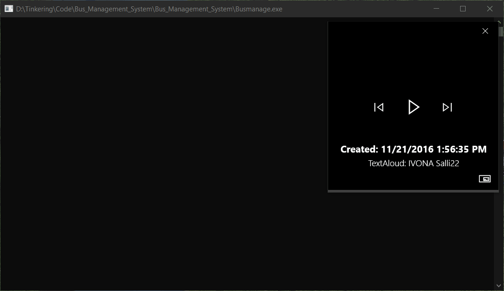

# Bus Ticket Management System

>Replica for Bus ticket Management used here in India, my first C project in 2016 demostrating Linked list Data Structures

## Features

1.	Print tickets.
2.	Print Daily pass.
3.	Update current stop.
4.	Announce current stop.
5.	Annouce  next stop.
6.	Ticket data base.

Mp3's are played using system's default player.

